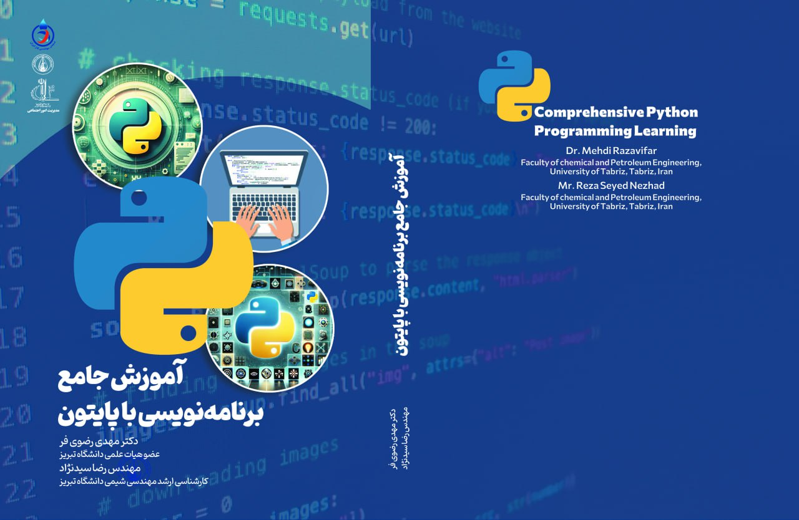

# Comprehensive Python Programming Learning

A collection of **Python example codes** and **practice exercises** created alongside my Python educational book project. This repository is designed to provide hands‑on experience with Python programming through simple, clear, and structured examples.

---

<p align="center">
  
</p>

---

## 📘 About This Repository

This repository contains:

* **Examples**: Source codes used throughout the book chapters.
* **Exercises**: Practice questions for learning and self‑assessment.
* **requirements.txt**: A list of libraries used (if any).
* **Clean project structure** for easy navigation and learning.

> ⚠️ *Note:* The **full book content is not public**. Only the codes and exercises are included.

---

## 📂 Project Structure

```
Comprehensive-Python-Programming-Learning/
│
├── examples/        # Python example codes from the book
├── exercises/       # Practice exercises for each chapter
├── requirements.txt # Project dependencies
├── .gitignore       # Ignored system & Python cache files
└── README.md        # This file
```

---

## 🚀 Getting Started

### 1. Clone the repository

```bash
git clone https://github.com/Reza-Seyyednezhad/Comprehensive-Python-Programming-Learning.git
```

### 2. (Optional) Install dependencies

If the examples use external libraries:

```bash
pip install -r requirements.txt
```

### 3. Explore the examples

Navigate to the examples folder:

```bash
cd examples
```

Run any script:

```bash
python example01.py
```

---

## 🧠 Exercises

The **exercises** folder contains Python practice problems covering:

* Basics & printing
* Variables & data types
* Operators
* Conditions (if/else)
* Loops
* Lists
* Functions
* File handling

More exercises and difficulty levels (Beginner / Intermediate / Advanced) will be added soon.

---
# آموزش جامع برنامه‌نویسی با پایتون (نسخه فارسی README)
## 📘 درباره این مخزن

این مخزن شامل:

* **کدهای مثال** مورد استفاده در فصل‌های کتاب
* **تمرین‌های پایتون** برای یادگیری بهتر
* فایل‌های کمکی مانند **requirements.txt** و **.gitignore**

> ⚠️ *توجه:* محتوای کامل کتاب منتشر نشده و فقط کدها و تمرین‌ها قرار داده شده‌اند.

---

## 📂 ساختار پروژه

```
Comprehensive-Python-Programming-Learning/
│
├── examples/        # مثال‌های پایتون
├── exercises/       # تمرین‌ها
├── requirements.txt # کتابخانه‌های مورد نیاز
├── .gitignore       # فایل‌های نادیده گرفته شده
└── README.md        # فایل توضیحات پروژه
```

---

## 🚀 شروع کار

### ۱. کلون کردن مخزن

```bash
git clone https://github.com/Reza-Seyyednezhad/Comprehensive-Python-Programming-Learning.git
```

### ۲. (اختیاری) نصب پیش‌نیازها

```bash
pip install -r requirements.txt
```

### ۳. اجرای مثال‌ها

```bash
cd examples
python example01.py
```

---

## 🧠 تمرین‌ها

تمرین‌های موجود موضوعات زیر را پوشش می‌دهند:

* مبانی پایتون
* متغیرها و انواع داده
* عملگرها
* شرط‌ها
* حلقه‌ها
* لیست‌ها
* توابع
* کار با فایل‌ها

سطح‌بندی و تمرین‌های بیشتر به‌زودی اضافه می‌شود.

---

## 📮 ارتباط

برای پیشنهاد، رفع اشکال یا بهبود پروژه خوشحال می‌شوم مشارکت کنید.

---

⭐ **Thank you for visiting the repository!**


